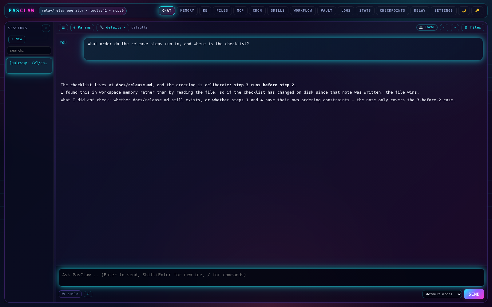
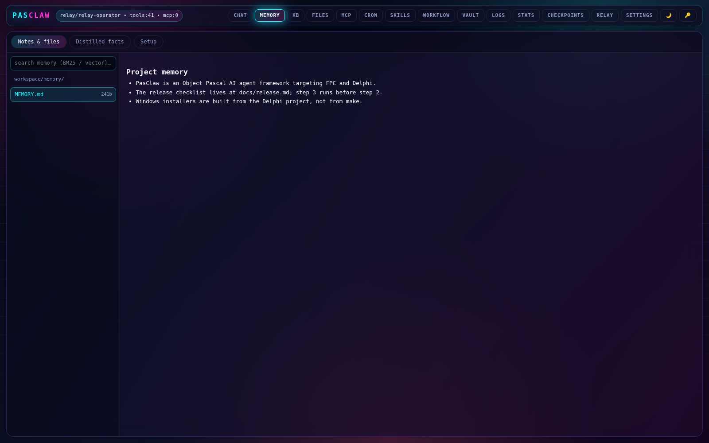
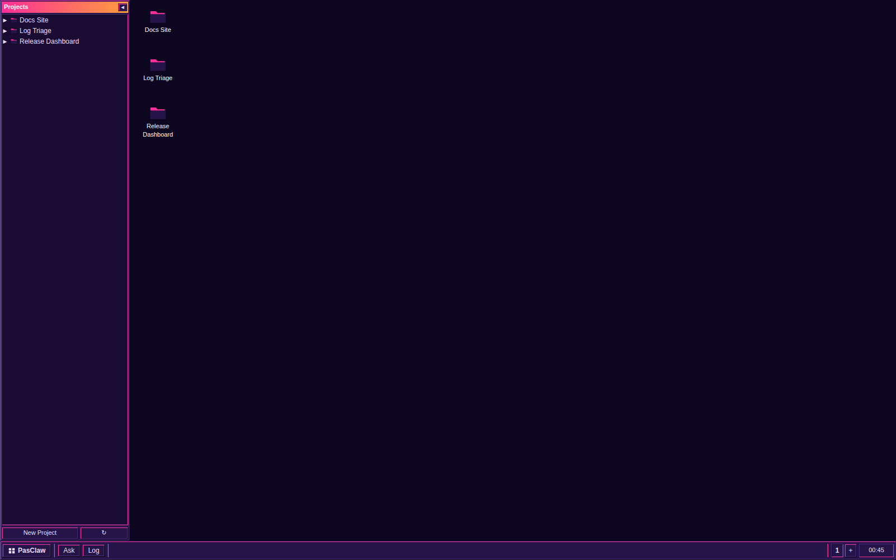

# Screenshots

PasClaw's two browser surfaces, both served by `pasclaw serve` / `pasclaw
gateway` on the same port.

## Web UI — chat (`/`)



The full operator console: session list, the tab strip across every
subsystem (memory, KB, files, MCP, cron, skills, workflow, vault, logs,
stats, checkpoints, relay, settings), and a composer with mode and model
pickers. The header reads `<provider>/<model> • tools:N • mcp:N`.

## Web UI — memory (`/` → MEMORY)



`workspace/memory/*.md` with BM25 + vector search over it, alongside the
distilled fact store on its own tab.

## Web desktop (`/desktop`)



The project-oriented surface: a Projects panel, desktop icons per project,
and a taskbar with Ask and Log. This is the browser desktop — distinct from
the native FMX desktop application, which is not shown here.

## Regenerating

`capture.py` seeds a gateway and drives headless Chromium against it. Two
steps, because the gateway has to be running in between:

```sh
# 1. write the fixture PASCLAW_HOME (config + MEMORY.md)
python3 docs/screenshots/capture.py init /tmp/pasclaw-shots

# 2. start a gateway against it
PASCLAW_HOME=/tmp/pasclaw-shots build/pasclaw serve --addr 127.0.0.1 --port 8330 &

# 3. seed projects + one conversation, then capture
python3 docs/screenshots/capture.py shoot docs/screenshots
```

`shoot` exits non-zero if any page logs a JavaScript error, so an unattended
regeneration cannot quietly replace these with pictures of a broken UI.

Chromium comes from Playwright (`python3 -m playwright install chromium`).
Set `PASCLAW_SHOT_CHROME=/path/to/chrome` to use a browser Playwright did not
install — needed on hosts that ship a preinstalled revision Playwright will
not look for.

### What "reproducible" means here

`web-ui-chat.png` and `web-ui-memory.png` regenerate **byte-identical** to
the committed files. `web-desktop.png` does not: the taskbar shows a wall
clock, so those bytes differ on every run. Everything else about it is
deterministic.

## The content is fixture data

The shots are deliberately taken against a gateway holding real content — a
finished conversation, a seeded `workspace/memory/MEMORY.md`, and three
projects. An empty instance photographs the chrome and nothing else, which is
what the first attempt at these produced: a blank chat pane and "No projects
yet."

That content is created by `capture.py`, not recorded from a real session.
The projects are invented, and the assistant reply is a string in the script
delivered through the relay provider rather than anything a model generated —
which is also why the recipe needs no API key and no network. Nothing here
should be read as a benchmark or a product claim.
